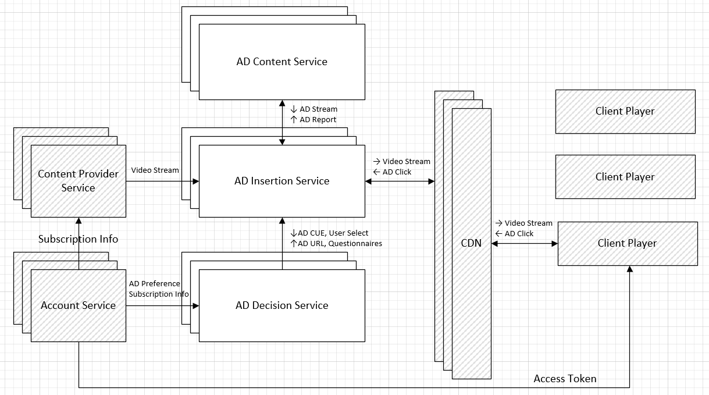

# PROJECT NOT UNDER ACTIVE MANAGEMENT #  
This project will no longer be maintained by Intel.  
Intel has ceased development and contributions including, but not limited to, maintenance, bug fixes, new releases, or updates, to this project.  
Intel no longer accepts patches to this project.  
 If you have an ongoing need to use this project, are interested in independently developing it, or would like to maintain patches for the open source software community, please create your own fork of this project.  
  
[](https://travis-ci.com/OpenVisualCloud/Ad-Insertion-Sample)
[](https://github.com/OpenVisualCloud/Ad-Insertion-Sample/releases/tag/v1.0)
[](https://github.com/OpenVisualCloud/Ad-Insertion-Sample/blob/master/LICENSE)
[](https://github.com/OpenVisualCloud/Ad-Insertion-Sample/wiki)


The E2E sample implements a server-side AD insertion system, which features on-demand video transcoding and streaming, and AD insertion based on video content analysis.



The [Content Provider](content-provider/README.md) service serves original content, with on-demand transcoding, through the DASH or HLS streaming protocol. The [AD Insertion](ad-insertion/README.md) service analyzes video content on the fly and inserts AD, with transcoding if needed, into the video stream at each AD break slot.

See Also: [Demo Video](https://www.youtube.com/watch?v=aNeFV6cC_wE)   

### Software Stack: 

The sample is powered by the following Open Visual Cloud software stacks:  

- The [FFmpeg-based media transcoding software stack](https://github.com/OpenVisualCloud/Dockerfiles/tree/master/Xeon/ubuntu-18.04/media/ffmpeg) is used to transcode video or Ad content to DASH or HLS during playback. The software stack is optimized for [Intel® Xeon® Scalable Processors](https://github.com/OpenVisualCloud/Dockerfiles/tree/master/Xeon/ubuntu-18.04/media/ffmpeg).     
- The [FFmpeg-based media analytics software stack](https://github.com/OpenVisualCloud/Dockerfiles/tree/master/Xeon/ubuntu-18.04/analytics/ffmpeg) is used, with `FRAMEWORK=ffmpeg`, to analyze video content for objects, emotion and faces during playback. The software stack is optimized for [Intel Xeon Scalable Processors](https://github.com/OpenVisualCloud/Dockerfiles/tree/master/Xeon/ubuntu-18.04/analytics/ffmpeg) and [Intel VCAC-A](https://github.com/OpenVisualCloud/Dockerfiles/tree/master/VCAC-A/ubuntu-18.04/analytics/ffmpeg).  
- The [GStreamer-based media analytics software stack](https://github.com/OpenVisualCloud/Dockerfiles/tree/master/Xeon/ubuntu-18.04/analytics/gst) is used, with `FRAMEWORK=gst`, to analyze video content for objects, emotion and faces during playback. The software stack is optimized for [Intel Xeon Scalable Processors](https://github.com/OpenVisualCloud/Dockerfiles/tree/master/Xeon/ubuntu-18.04/analytics/gst) and [Intel VCAC-A](https://github.com/OpenVisualCloud/Dockerfiles/tree/master/VCAC-A/ubuntu-18.04/analytics/gst).  

### Install Prerequisites:

- **Timezone**: Check that the timezone setting of your host machine is correctly configured. Timezone is used during build. If you plan to run the sample on a cluster of machines managed by Docker Swarm or Kubernetes, please make sure to synchronize time among the manager/master node and worker nodes.    

- **Build Tools**: Install `cmake` and `m4` if they are not available on your system.        

- **Docker Engine**:        
  - Install [docker engine](https://docs.docker.com/install). Make sure you [setup](https://docs.docker.com/install/linux/linux-postinstall) docker to run as a regular user.       
  - Setup [docker swarm](https://docs.docker.com/engine/swarm), if you plan to deploy through docker swarm. See [Docker Swarm Setup](deployment/docker-swarm/README.md) for additional setup details.  
  - Setup [Kubernetes](https://kubernetes.io/docs/setup), if you plan to deploy through Kubernetes. See [Kubernetes Setup](deployment/kubernetes/README.md) for additional setup details.     
  - Setup docker proxy as follows if you are behind a firewall:   

```bash
sudo mkdir -p /etc/systemd/system/docker.service.d       
printf "[Service]\nEnvironment=\"HTTPS_PROXY=$https_proxy\" \"NO_PROXY=$no_proxy\"\n" | sudo tee /etc/systemd/system/docker.service.d/proxy.conf       
sudo systemctl daemon-reload          
sudo systemctl restart docker     
```

### Build: 

```bash
mkdir build    
cd build     
cmake ..    
make     
```
See also how to customize the building process with [Build Options](doc/cmake.md).

### Generate DASH/HLS

By default, DASH/HLS segments are generated on the fly during playback, which requires a powerful server platform to keep up with the load. If unsure, it is recommended that you use the following commands to pre-generate DASH/HLS segments:

```bash
#content segment
make dash    # take a coffee break?        
make hls     # take a walk?!      

# ad segment
make addash
make adhls
```

### Start/stop Services:

Use the following commands to start/stop services via docker swarm (see also [Docker Swarm Setup](deployment/docker-swarm/README.md)).    

```bash
make update # optional for private registry
make start_docker_swarm      
make stop_docker_swarm      
```

Use the following commands to start/stop services via Kubernetes (see also [Kubernetes Setup](deployment/kubernetes/README.md)):        

```bash
make update # optional for private registry
make volume
make start_kubernetes      
make stop_kubernetes      
```

### Launch browser:

Launch your browser and point to `https://<hostname>` to see the sample UI. Double click on any video clip to play the stream and see ADs got inserted during playback. 

</IMG>

---

- For Kubernetes/Docker Swarm, `<hostname>` is the hostname of the manager/master node.
- If you see a browser warning of self-signed certificate, please accept it to proceed to the sample UI.

---

### See Also:

- [Docker Swarm Setup](deployment/docker-swarm/README.md)  
- [Kubernetes Setup](deployment/kubernetes/README.md)  
- [Intel VCAC-A Setup](doc/vcac-a.md)
- [Build Configuration](doc/cmake.md)   
- [Customize Videos](doc/customize.md)   
- [Sample Distribution](doc/dist.md)  
- [Utility Script](doc/script.md)  
- [Demo Video](https://www.youtube.com/watch?v=aNeFV6cC_wE)  
