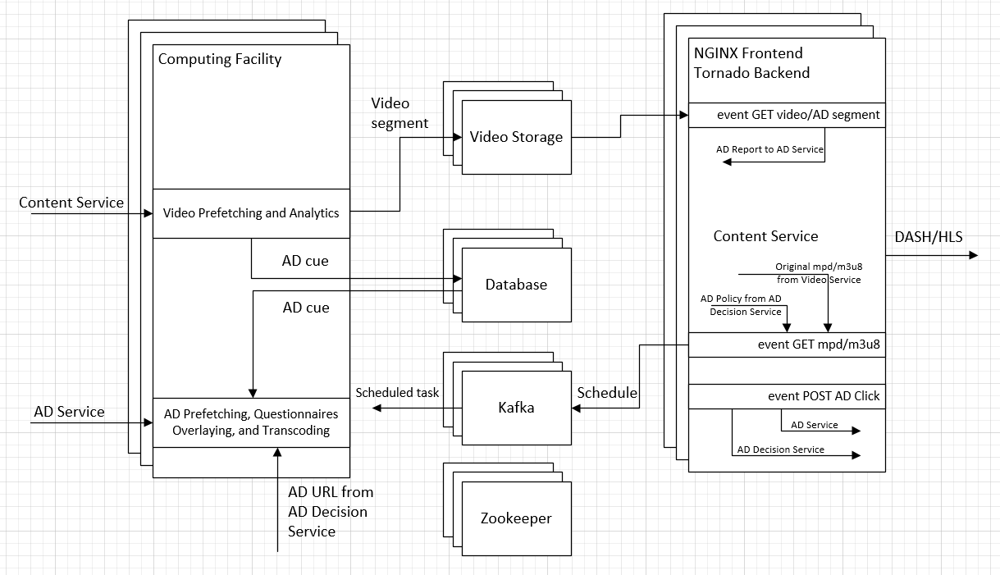
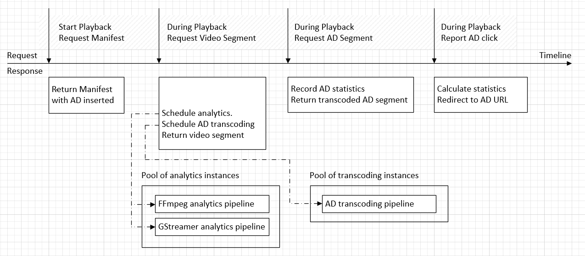

The AD Insertion service implements the logic of inserting AD during video playback. 

The AD Insertion service operates as follows:      
- The client player starts video playback by requesting the video manifest file, which describes the DASH/HLS segments. The AD Insertion service intercepts the request, retrieves the manifest from the [Content Provider](../content-provider/README.md), and then inserts ADs into the manifest, before returning to the client player.    
- The AD Insertion service also schedules analysis of the video segment or construction of the AD segment before the segment is about to be played. For example, fetching video segment *i* leads to analyzing video segment *i* and constructing the next AD, assuming there is an AD break following video segment *i*.    
- In the background, two pipelines are running, scheduled by Kafka, to analyze the video segments, and to construct AD segments. The analyzed results are saved to the database for later use. The constructed AD segments will be sent to the client player upon request.    
- The AD Insertion service keeps track of how many AD segments are served to the client player and reports the statistics to the [AD Content](../ad-content/README.md) service.    
- If the user clicks on any portion of the playback screen, the AD Insertion service interpret the click to be either an AD click or a question/answer click. Report the click to the [AD Content](../ad-content/README.md) service or the [AD Decision](../ad-content/ad-decision/README.md) service for further action.       

### Analyze video segment:

The AD Insertion service pre-fetches video segements before their playtime to analyze the content. The result are saved to the database to personalize any AD construction at a later time.

The following analyses are supported:

| Analysis | Description |
|:--------:|-------------|
|  Face detection/tracking | Detect and track faces to associate certain celebeties with their ADs. |
| Emotion detection | Detect person emotions. |
| Object detection | Detect object types such as vehicles. |

### Construct AD segment:

The AD Insertion service constructs an AD segemnt as follows:    
- Query the database for the past few seconds of the analytics data.    
- Sent the request to the [AD Decision](../ad-content/ad-decision/README.md) service for the relevant AD URL.   
- Transcode the AD content to match the quality (resolution and bitrate) of the video segment.  

### Interface:

The AD Insertion service exposes the following interfaces on port 8080:    
 
| Path | Description |
|----|------|
|GET /  | Pass through to the [Content Provider](../content-provider/README.md) serivce. |
|GET /dash  | Intercept DASH playback and pass through to the [Content Provider](../content-provider/README.md) service. |
|GET /hls  | Intercept HLS playback and pass through to the [Content Provider](../content-provider/README.md) service. |
|POST /api/click?x=\<num\>&y=\<num\>&name=\<user\>  | Respond to user mouse click. The click position is in \<x,y\>. |
