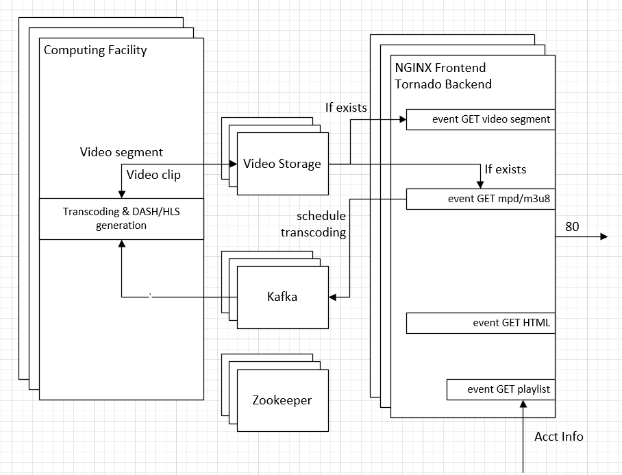

The Content Provider is a web service that serves videos. Any DASH/HLS player can connect to the service and playback the videos.

The Content Provider operates as follows:      
- The client player requests the playlist from the Content Provider, which checks the [Account](../account/README.md) service for the user subscription information and returns the playable stream list.   
- The client player starts playback of a video by requesting the video manifest file.     
- The Content Provider checks if the video has been transcoded. If the DASH/HLS segments exist, the Content Provider simply returns the manifest (and any subsequent video segments.) Otherwise, the Content Provider schedules transcoding of the video in Kafka, a message system shared between the web frontend and backend batch services.     
- The backend batch service receives the request and starts transcoding of the video clip.     
- The Content Provider returns the resulting DASH/HLS manifest and segments to the client player.        

### Video archive:

The archive directory saves original videos prepared during the build time. By default, the Content Provider transcodes those videos to DASH/HLS segments on demand according to the playback request.    

You can also pre-transcode the videos to DASH/HLS segments by issuing `make dash` and/or `make hls` build command(s). Offline transcoding will result in more video encoding options and generally better quality.    

### Interface:

The Content Provider exposes the following interfaces on port 8080:    
 
| Path | Description |
|----|------|
|GET /|The end point serves the HTML page and a JavaScript DASH/HLS player. |
|GET /api/playlist?name=\<user\> | The end point returns the list of streams playable by the specified user.|

